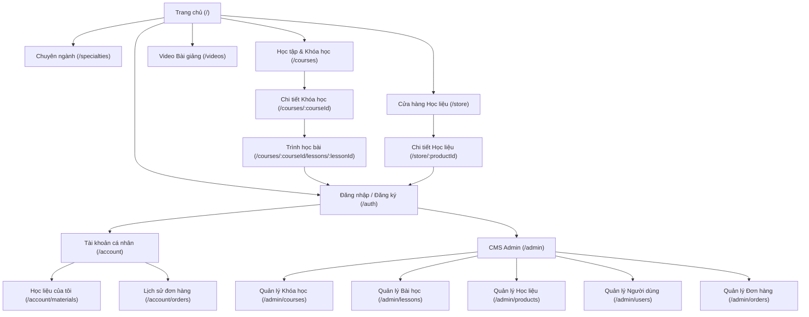

# TÀI LIỆU KIẾN TRÚC & PHÂN TÍCH: MECHANICALBKA V1

Tài liệu này trình bày toàn bộ kết quả phân tích hệ sinh thái nội dung từ kênh YouTube của tác giả và website tham khảo [Vertanux1](http://www.vertanux1.com), đồng thời đề xuất kiến trúc hệ thống, cơ sở dữ liệu, giao diện, và lộ trình phát triển chi tiết cho website mới **MechanicalBKA**.

---

## PHẦN 1 — PHÂN TÍCH YOUTUBE (@trongbka)

Kênh YouTube [@trongbka](https://youtube.com/@trongbka) đóng vai trò là lõi nội dung giảng dạy trực quan và động lực tương tác cộng đồng của thương hiệu.

### 1. Chủ đề chính của kênh
Kênh tập trung vào đào tạo kỹ thuật chuyên sâu thuộc các lĩnh vực:
*   **Kỹ thuật Polymer & Composite**: Khoa học vật liệu nhựa, cơ học chất lỏng polymer, công nghệ đùn và ép phun.
*   **Thiết kế khuôn mẫu (Mold Design)**: Chuyên sâu về thiết kế khuôn ép phun nhựa (Plastic Injection Mold).
*   **Gia công cơ khí & Chế tạo máy**: Công nghệ chế tạo máy, lập trình gia công (CNC, tiện, phay), dụng cụ cắt gọt.
*   **Cơ học dập tạo hình**: Thiết kế khuôn dập tấm và công nghệ biến dạng kim loại.

### 2. Các nhóm nội dung (Playlists) chính
Nội dung kênh được cấu trúc theo các học phần (Modules) đại học chuyên sâu:
*   **Module 1: Chế tạo máy** (CNC, dụng cụ cắt, quy trình công nghệ gia công).
*   **Module 2: Công nghệ và khuôn dập tạo hình** (Dập tấm, thiết kế chày cối dập).
*   **Module 5.1: Plastic and Composite Materials** (Khoa học vật liệu polymer).
*   **Module 5.2: Composite Manufacturing Technology** (Công nghệ chế tạo composite).
*   **Module 5.3: Mechanics of Polymeric Liquids** (Cơ chất lỏng polymer, dòng chảy nhựa).
*   **Module 5.4: Polymer Extrusion Process and Equipments** (Quy trình và thiết bị đùn nhựa).
*   **Module 5.5: Polymer Injection Molding Process and Equipment** (Quy trình và thiết bị ép phun).
*   **Module 5.6: Project in Mold for Plastics** (Đồ án/Dự án thiết kế khuôn nhựa).
*   **Module 5.7: Mechanics of Plastic and Composite Materials** (Cơ học vật liệu nhựa và composite).

### 3. Phần mềm sử dụng chuyên ngành
*   **Autodesk Inventor / Mold Design**: Thiết kế chi tiết 3D, lắp ráp khuôn, tách lòng khuôn (core/cavity).
*   **SOLIDWORKS**: Thiết kế cơ khí, mô hình hóa sản phẩm.
*   **X-TIMON**: Mô phỏng phân tích dòng chảy nhựa trong khuôn (CAE Injection Molding).

### 4. Đối tượng người dùng mục tiêu
*   **Sinh viên ngành Cơ khí/Chế tạo máy/Vật liệu**: Học tập lý thuyết và làm đồ án tốt nghiệp.
*   **Kỹ sư thiết kế khuôn (Mold Designers)**: Cần tài liệu nâng cao tay nghề thực tế và tra cứu thông số kỹ thuật.
*   **Kỹ sư Polymer/Composite**: Nghiên cứu công nghệ sản xuất và cơ học dòng chảy nhựa.

### 5. Chiến lược tích hợp nội dung lên Website
*   **Đưa vào Website**:
    *   Các file bài tập thực hành CAD tương ứng với video.
    *   Slide bài giảng lý thuyết (PDF), đề thi trắc nghiệm thử nghiệm.
    *   Metadata của video (Tiêu đề, mô tả ngắn, hình thu nhỏ) để người học dễ tìm kiếm và liên kết chéo với tài liệu.
*   **Liên kết trực tiếp về YouTube**:
    *   Trình phát video trực tiếp nhúng (YouTube Embedded Player) trong các bài học.
    *   Nút chuyển hướng tới danh sách phát (Playlist) gốc trên YouTube để tối ưu băng thông máy chủ và tăng tương tác (Subscribe/View) cho kênh của tác giả.

---

## PHẦN 2 — PHÂN TÍCH WEBSITE VERTANUX1

Website [Vertanux1](http://www.vertanux1.com) là một nền tảng chia sẻ học liệu CAD/CAE/CAM miễn phí lớn của tác giả C.F. Sikora. Dưới đây là phân tích cấu trúc và đề xuất cải tiến cho **MechanicalBKA**.

### 1. Phân tích cấu trúc hiện tại
*   **Sitemap & Navigation**: Cực kỳ đơn giản và phẳng (Home, Instructional Manuals, Part Files, Videos, Exams, About, Contact).
*   **Tổ chức học liệu**:
    *   Tổ chức theo chiều ngang (Software-centric). Mỗi phần mềm có một danh mục riêng chứa tất cả các hướng dẫn từ cơ bản đến nâng cao.
    *   Một bài tập (ví dụ: Exercise 5) được giải bằng nhiều phần mềm khác nhau (Inventor, Creo, NX, SolidWorks), dùng chung bản vẽ kỹ thuật PDF nhưng khác file CAD nguồn.
*   **Lưu trữ & Tải file**: Toàn bộ tài liệu PDF hướng dẫn, đề thi và file CAD (nén trong file `.zip`) đều được host trên **Google Drive** công cộng.
*   **Video**: Nhúng danh sách phát YouTube dạng lưới đơn giản.
*   **Thanh toán/Tài khoản**: Không có. Trang hoàn toàn miễn phí, không yêu cầu đăng nhập.

### 2. Định hướng kế thừa và cải tiến cho MechanicalBKA

| Chức năng | Trạng thái trên Vertanux1 | Đề xuất cho MechanicalBKA mới |
| :--- | :--- | :--- |
| **Phân loại học liệu** | Phân theo Software & Course. | **Giữ lại & Nâng cấp**: Kết hợp phân loại theo Chuyên ngành (Specialty) và Phần mềm (Software) thông qua quan hệ nhiều-nhiều. |
| **Học liệu dùng chung** | Một bản vẽ PDF dùng cho nhiều file CAD của các phần mềm khác nhau. | **Giữ lại**: Thiết kế database cho phép một Học liệu (Product/Material) liên kết với nhiều phần mềm và định dạng file khác nhau. |
| **Giao diện & UX** | Cổ điển, thô sơ, dựng bằng GoDaddy Builder, không tương thích tốt trên mobile. | **Cải tiến mạnh mẽ**: Thiết kế Modern Dark Theme chuyên nghiệp, Responsive, tối ưu hóa hiển thị thẻ (card) kỹ thuật, hỗ trợ bộ lọc động (Filter). |
| **Lưu trữ tài liệu** | Host hoàn toàn trên Google Drive công cộng. | **Cải tiến bảo mật**: Chuyển các file trả phí/bảo mật sang Firebase Storage (Private Bucket), quản lý qua Cloud Functions và cấp link tải tạm thời (Signed URL). |
| **Tài khoản người dùng** | Không có. | **Bổ sung**: Hệ thống đăng nhập/đăng ký (Firebase Auth) để cá nhân hóa lộ trình học, lưu lịch sử học và quản lý học liệu sở hữu. |
| **Thanh toán & Bản quyền** | Không có (Free hoàn toàn). | **Bổ sung**: Cửa hàng học liệu (Store) cho phép mua các khóa học nâng cao hoặc file CAD/Khuôn mẫu độc quyền (Hỗ trợ phân biệt Free, Paid, Owned). |
| **Hệ thống quản trị (CMS)** | Sửa thủ công bằng web builder. | **Bổ sung**: Trang Admin CMS động giúp quản trị viên thêm khóa học, bài học, tải file mới lên mà không cần sửa code nguồn frontend. |

---

## PHẦN 3 — ĐỊNH HƯỚNG MECHANICALBKA MỚI

Nền tảng **MechanicalBKA** mới sẽ định hình là cổng học tập và mua bán học liệu cơ khí trực tuyến chất lượng cao tại Việt Nam.

### 1. Bốn chuyên ngành trọng tâm
1.  **Polymer & Composite**: Đào tạo lý thuyết vật liệu polymer, composite, công nghệ sản xuất nhựa đùn, ép phun.
2.  **Khuôn mẫu & Mold Design**: Thiết kế khuôn ép phun nhựa, khuôn dập, tách khuôn cơ bản và nâng cao.
3.  **Chi tiết máy**: Nguyên lý máy, thiết kế chi tiết máy, công nghệ gia công chế tạo.
4.  **CAD / CAE**: Hướng dẫn dựng hình 3D (CAD) và mô phỏng số học dòng chảy/ứng suất cơ học (CAE).

### 2. Phần mềm giảng dạy chính
*   **Autodesk Inventor**: Dựng hình 3D, xuất bản vẽ thiết kế (định dạng `.ipt`, `.iam`, `.idw`).
*   **Mold Design / Mold Inventor**: Module thiết kế khuôn chuyên nghiệp của Autodesk.
*   **SOLIDWORKS**: Thiết kế chi tiết cơ khí và lắp ráp khuôn máy (định dạng `.sldprt`, `.sldasm`).
*   **X-TIMON**: Phần mềm CAE mô phỏng điền đầy dòng chảy nhựa, tối ưu hóa kênh dẫn và chu kỳ làm nguội khuôn.

---

## PHẦN 4 — XÂY DỰNG SITEMAP MỚI

Sơ đồ trang web của MechanicalBKA được phân cấp để phục vụ cả người học đại chúng, học viên đã mua tài liệu, và quản trị viên hệ thống.



---

## PHẦN 5 — KIẾN TRÚC HỌC LIỆU

Hệ thống quản lý nội dung số của MechanicalBKA được thiết kế theo mối quan hệ nhiều-nhiều động, đảm bảo một học liệu hoặc khóa học có thể áp dụng cho nhiều phần mềm khác nhau mà không bị trùng lặp dữ liệu.

### Sơ đồ phân cấp logic học tập:

$$\text{Specialty (Chuyên ngành)} \longrightarrow \text{Software (Phần mềm)} \longrightarrow \text{Course (Khóa học)} \longrightarrow \text{Lesson (Bài học)} \longrightarrow \text{Learning Material (Học liệu)} \longrightarrow \text{File / Video}$$

*   **Quan hệ Specialty - Software**: Một phần mềm (ví dụ: Autodesk Inventor) có thể được dạy trong nhiều chuyên ngành khác nhau (ví dụ: Mold Design và CAD/CAE).
*   **Quan hệ Course - Software**: Một khóa học có thể tập trung vào một hoặc nhiều phần mềm đồng thời (ví dụ: Thiết kế & mô phỏng khuôn sử dụng cả *Mold Design* và *X-TIMON*).
*   **Quan hệ Lesson - Learning Material**: Một bài học chứa danh sách các học liệu thực hành (bản vẽ PDF, file CAD 3D mẫu). Một học liệu có thể dùng chung cho nhiều bài học khác nhau để tối ưu hóa tài nguyên.

---

## PHẦN 6 — PHÂN LOẠI & TRẠNG THÁI HỌC LIỆU

Để phục vụ tốt nhất việc phân phối nội dung, hệ thống phân biệt rõ ràng giữa các loại định dạng file và trạng thái sở hữu của người dùng.

### 1. Định dạng file hỗ trợ
*   **Tài liệu viết**: PDF (Manuals, đề thi, bản vẽ chế tạo), ảnh minh họa (JPG, PNG).
*   **File CAD nguồn (Autodesk Inventor)**: `.ipt` (part file), `.iam` (assembly file), `.idw` (drawing file).
*   **File CAD nguồn (SOLIDWORKS)**: `.sldprt` (part file), `.sldasm` (assembly file).
*   **Định dạng CAD trung gian**: `.step` / `.stp` (định dạng trao đổi CAD chuẩn).
*   **File nén đóng gói**: `.zip` (chứa toàn bộ dự án khuôn mẫu hoặc cụm chi tiết máy).
*   **Video**: Link YouTube hoặc mã nhúng YouTube Video.

### 2. Trạng thái sở hữu học liệu (Entitlement Model)
Hệ thống sử dụng bộ lọc quyền truy cập ở cấp độ Backend dựa trên trạng thái sở hữu của tài khoản:

*   `FREE`: Tài liệu công cộng. Bất kỳ ai (kể cả khách chưa đăng nhập) đều có thể xem bài viết và tải file trực tiếp.
*   `PAID`: Học liệu/Khóa học cần thanh toán tiền. Trạng thái này yêu cầu người dùng phải mua qua Cửa hàng học liệu.
*   `OWNED`: Trạng thái động. Khi học viên mua thành công một học liệu `PAID`, Backend sẽ tạo một bản ghi `entitlement` liên kết `userId` với `productId`. Người dùng có quyền truy cập này sẽ tải được file private.

---

## PHẦN 7 — THIẾT KẾ PHÂN QUYỀN (RBAC)

Hệ thống phân chia người dùng thành 2 nhóm quyền chính (Roles): `Student` và `Admin`.

```
  +------------------+
  |     Student      |
  +--------+---------+
           |
           +---> Đăng ký / Đăng nhập tài khoản
           +---> Xem danh mục Chuyên ngành, Phần mềm, Khóa học
           +---> Học các bài học FREE hoặc bài học trong khóa học đã mua
           +---> Mua học liệu / khóa học thông qua giỏ hàng (Store)
           +---> Xem kho học liệu cá nhân đã sở hữu (OWNED)
           +---> Tải file học liệu được cấp quyền (yêu cầu verify ở Backend)
           
  +------------------+
  |      Admin       |
  +--------+---------+
           |
           +---> Toàn bộ quyền của Student
           +---> Truy cập Admin CMS điều khiển toàn hệ thống
           +---> CRUD Chuyên ngành (Specialties), Phần mềm (Software)
           +---> CRUD Khóa học (Courses) và các Bài học (Lessons)
           +---> Quản lý kho Học liệu (Products/Materials) & upload file lên Private Storage
           +---> Quản lý thông tin tài khoản người dùng và gán quyền thủ công
           +---> Xem danh sách và cập nhật trạng thái đơn hàng (Orders)
```

---

## PHẦN 8 — KIẾN TRÚC DOWNLOAD BẢO MẬT

Để ngăn chặn việc rò rỉ học liệu trả phí, MechanicalBKA áp dụng quy trình tải file gián tiếp thông qua mã xác thực và link tải có thời hạn ngắn (Signed URL).

### Sơ đồ luồng tải file bảo mật:

```
[ Browser (Client) ]
       │
       │ 1. Request Download (productId, Token)
       ▼
[ Authentication (Firebase Auth) ] ── (Verify ID Token)
       │
       │ 2. Token hợp lệ -> Chuyển hướng yêu cầu kèm UID
       ▼
[ Backend (Firebase Cloud Function) ]
       │
       │ 3. Truy vấn Firestore kiểm tra quyền sở hữu (Entitlement)
       ▼
[ Entitlements Collection (Firestore) ]
       │
       │ 4. Xác nhận: Người dùng sở hữu File này? (Yes / No)
       ▼
[ Backend (Firebase Cloud Function) ]
       │
       │ 5. (Nếu YES) Tạo link tải có thời hạn (Signed URL - ví dụ: 5 phút)
       ▼
[ Cloud Storage (Private Bucket) ]
       │
       │ 6. Trả về Signed URL bảo mật
       ▼
[ Backend (Firebase Cloud Function) ]
       │
       │ 7. Trả về Signed URL cho Client
       ▼
[ Browser (Client) ]
       │
       │ 8. Tự động tải file qua Signed URL
       ▼
[ Người dùng nhận file hoàn tất ]
```

> [!IMPORTANT]
> **Nguyên tắc bảo mật:**
> 1. File trả phí tuyệt đối không lưu ở thư mục public trong Storage.
> 2. Client không bao giờ biết URL trực tiếp của Private Storage Bucket.
> 3. Signed URL chỉ tồn tại trong thời gian ngắn (ví dụ: 5 phút) và tự động hết hạn sau đó.

---

## PHẦN 9 — THIẾT KẾ CƠ SỞ DỮ LIỆU (FIRESTORE SCHEMA)

Firestore là một NoSQL database tài liệu (Document-based). Dưới đây là thiết kế chi tiết cho các collection cần thiết của **MechanicalBKA**.

### 1. Collection `users`
*   **Mục đích**: Lưu trữ thông tin cá nhân và vai trò phân quyền của người dùng.
*   **Đường dẫn**: `/users/{uid}`
*   **Các trường dữ liệu**:
    *   `uid` (string, primary key): Firebase Auth UID.
    *   `email` (string): Địa chỉ email đăng ký.
    *   `displayName` (string): Tên hiển thị của người dùng.
    *   `role` (string): Vai trò hệ thống (`student` hoặc `admin`).
    *   `createdAt` (timestamp): Thời gian tạo tài khoản.
    *   `lastLoginAt` (timestamp): Thời gian đăng nhập cuối cùng.
*   **Ví dụ document**:
    ```json
    {
      "uid": "usr_90218391283",
      "email": "nguyenvan@gmail.com",
      "displayName": "Nguyễn Văn A",
      "role": "student",
      "createdAt": "2026-08-27T08:00:00Z",
      "lastLoginAt": "2026-08-27T15:00:00Z"
    }
    ```

### 2. Collection `specialties`
*   **Mục đích**: Quản lý 4 chuyên ngành cơ khí của website.
*   **Đường dẫn**: `/specialties/{specialtyId}`
*   **Các trường dữ liệu**:
    *   `id` (string): Mã chuyên ngành.
    *   `name` (string): Tên chuyên ngành (Polymer & Composite, v.v.).
    *   `slug` (string): Tên không dấu dạng url (`polymer-composite`).
    *   `description` (string): Mô tả tóm tắt chuyên ngành.
    *   `order` (number): Thứ tự hiển thị trên menu.
*   **Ví dụ document**:
    ```json
    {
      "id": "spec_polymer_composite",
      "name": "Polymer & Composite",
      "slug": "polymer-composite",
      "description": "Lý thuyết cơ học polymer, vật liệu nhựa và quy trình chế tạo composite.",
      "order": 1
    }
    ```

### 3. Collection `software`
*   **Mục đích**: Lưu trữ thông tin các phần mềm giảng dạy chính.
*   **Đường dẫn**: `/software/{softwareId}`
*   **Các trường dữ liệu**:
    *   `id` (string): Mã phần mềm.
    *   `name` (string): Tên phần mềm (Autodesk Inventor, X-TIMON, v.v.).
    *   `slug` (string): Tên dạng url (`autodesk-inventor`).
    *   `logoUrl` (string): Link ảnh logo phần mềm.
    *   `description` (string): Mô tả sơ lược tính năng phần mềm.
*   **Ví dụ document**:
    ```json
    {
      "id": "soft_inventor",
      "name": "Autodesk Inventor",
      "slug": "autodesk-inventor",
      "logoUrl": "https://firebasestorage.../inventor_logo.png",
      "description": "Thiết kế cơ khí 3D và tách khuôn nhựa."
    }
    ```

### 4. Collection `courses`
*   **Mục đích**: Lưu trữ các khóa học.
*   **Đường dẫn**: `/courses/{courseId}`
*   **Các trường dữ liệu**:
    *   `id` (string): Mã khóa học.
    *   `title` (string): Tiêu đề khóa học.
    *   `slug` (string): Tiêu đề dạng url.
    *   `description` (string): Mô tả chi tiết (hỗ trợ Markdown).
    *   `thumbnailUrl` (string): Hình ảnh đại diện khóa học.
    *   `specialtyIds` (array of strings): Các chuyên ngành liên kết.
    *   `softwareIds` (array of strings): Các phần mềm sử dụng trong khóa học (Quan hệ nhiều-nhiều).
    *   `price` (number): Giá bán khóa học (0 nếu hoàn toàn miễn phí).
    *   `isPublished` (boolean): Trạng thái hiển thị công khai.
    *   `createdAt` (timestamp): Ngày tạo.
*   **Ví dụ document**:
    ```json
    {
      "id": "course_inventor_mold_basics",
      "title": "Thiết kế Khuôn cơ bản trên Autodesk Inventor",
      "slug": "thiet-ke-khuon-co-ban-inventor",
      "description": "Khóa học hướng dẫn tách lòng khuôn và tạo hệ thống đẩy nhựa...",
      "thumbnailUrl": "https://firebasestorage.../inventor_mold.png",
      "specialtyIds": ["spec_mold_design", "spec_cad_cae"],
      "softwareIds": ["soft_inventor", "soft_mold_design"],
      "price": 250000,
      "isPublished": true,
      "createdAt": "2026-08-27T08:00:00Z"
    }
    ```

### 5. Collection `lessons`
*   **Mục đích**: Lưu trữ các bài học chi tiết của một khóa học.
*   **Đường dẫn**: `/lessons/{lessonId}`
*   **Các trường dữ liệu**:
    *   `id` (string): Mã bài học.
    *   `courseId` (string): Liên kết tới `courses` ID.
    *   `title` (string): Tiêu đề bài học.
    *   `slug` (string): Tiêu đề dạng url.
    *   `description` (string): Mô tả nội dung bài học.
    *   `order` (number): Thứ tự sắp xếp trong khóa học.
    *   `videoUrl` (string): Link video nhúng YouTube (hoặc YouTube Video ID).
    *   `materialIds` (array of strings): Danh sách ID học liệu đính kèm bài này (tải file).
    *   `isFreePreview` (boolean): Cho phép học thử không cần mua khóa học.
*   **Ví dụ document**:
    ```json
    {
      "id": "les_inventor_mold_l1",
      "courseId": "course_inventor_mold_basics",
      "title": "Bài 1: Tách lòng khuôn Core & Cavity",
      "slug": "bai-1-tach-long-khuon-core-cavity",
      "description": "Hướng dẫn nạp chi tiết nhựa và phân tích góc thoát khuôn.",
      "order": 1,
      "videoUrl": "https://www.youtube.com/embed/dQw4w9WgXcQ",
      "materialIds": ["mat_exercise_1_parts"],
      "isFreePreview": true
    }
    ```

### 6. Collection `products` (Learning Materials)
*   **Mục đích**: Lưu trữ học liệu tải về (bản vẽ, file CAD) dưới dạng sản phẩm có phí hoặc miễn phí.
*   **Đường dẫn**: `/products/{productId}`
*   **Các trường dữ liệu**:
    *   `id` (string): Mã học liệu.
    *   `title` (string): Tên học liệu.
    *   `description` (string): Mô tả chi tiết về học liệu.
    *   `price` (number): Giá bán (0 nếu miễn phí).
    *   `isFree` (boolean): `true` nếu miễn phí, `false` nếu trả phí.
    *   `softwareIds` (array of strings): Hỗ trợ nhiều phần mềm (Ví dụ: File thiết kế khuôn dập có cả bản SOLIDWORKS và Inventor).
    *   `fileTypes` (array of strings): Định dạng file có trong học liệu (`['IPT', 'SLDPRT', 'PDF']`).
    *   `storagePath` (string): Đường dẫn vật lý trên Cloud Storage (ví dụ: `materials/exercise1_mold.zip`).
    *   `fileName` (string): Tên hiển thị của file khi tải về (`exercise1_mold.zip`).
    *   `fileSize` (number): Kích thước file tính bằng byte.
    *   `createdAt` (timestamp): Ngày tạo.
*   **Ví dụ document**:
    ```json
    {
      "id": "mat_exercise_1_parts",
      "title": "File CAD bài tập thiết kế vỏ hộp nhựa - Bài 1",
      "description": "Chứa các file 3D gốc .ipt và bản vẽ PDF 2D hướng dẫn.",
      "price": 50000,
      "isFree": false,
      "softwareIds": ["soft_inventor"],
      "fileTypes": ["IPT", "PDF", "ZIP"],
      "storagePath": "materials/exercise1_mold.zip",
      "fileName": "exercise1_mold.zip",
      "fileSize": 10485760,
      "createdAt": "2026-08-27T08:00:00Z"
    }
    ```

### 7. Collection `orders`
*   **Mục đích**: Quản lý giao dịch mua khóa học hoặc học liệu của người dùng.
*   **Đường dẫn**: `/orders/{orderId}`
*   **Các trường dữ liệu**:
    *   `id` (string): Mã đơn hàng.
    *   `userId` (string): Liên kết tới `users` UID.
    *   `items` (array of maps): Danh sách sản phẩm đã mua:
        *   `productId` (string)
        *   `type` (string: `'course'` hoặc `'material'`)
        *   `price` (number)
    *   `totalAmount` (number): Tổng tiền đơn hàng.
    *   `status` (string): Trạng thái đơn hàng (`'pending'` | `'completed'` | `'cancelled'`).
    *   `paymentMethod` (string): Phương thức thanh toán (chuyển khoản, v.v.).
    *   `createdAt` (timestamp): Thời gian tạo đơn.
*   **Ví dụ document**:
    ```json
    {
      "id": "ord_20260827_0001",
      "userId": "usr_90218391283",
      "items": [
        {
          "productId": "course_inventor_mold_basics",
          "type": "course",
          "price": 250000
        }
      ],
      "totalAmount": 250000,
      "status": "completed",
      "paymentMethod": "Bank Transfer",
      "createdAt": "2026-08-27T15:30:00Z"
    }
    ```

### 8. Collection `entitlements`
*   **Mục đích**: Quản lý quyền sở hữu nội dung trả phí của từng người dùng. Giúp Backend kiểm tra nhanh khi có request tải file.
*   **Đường dẫn**: `/entitlements/{entitlementId}` (Document ID có cấu trúc `{userId}_{productId}` để tránh trùng lặp và truy vấn cực nhanh).
*   **Các trường dữ liệu**:
    *   `id` (string): Định danh dạng `{userId}_{productId}`.
    *   `userId` (string): Liên kết tới `users` UID.
    *   `productId` (string): Liên kết tới `products` hoặc `courses` ID.
    *   `type` (string): Nguồn gốc quyền sở hữu (`'purchase'` | `'admin_grant'` | `'free'`).
    *   `grantedAt` (timestamp): Thời điểm cấp quyền.
*   **Ví dụ document**:
    ```json
    {
      "id": "usr_90218391283_course_inventor_mold_basics",
      "userId": "usr_90218391283",
      "productId": "course_inventor_mold_basics",
      "type": "purchase",
      "grantedAt": "2026-08-27T15:31:00Z"
    }
    ```

---

## PHẦN 10 — HỆ THỐNG GIAO DIỆN (DESIGN SYSTEM)

MechanicalBKA hướng tới phong cách thiết kế đậm chất kỹ thuật cơ khí, hiện đại, chính xác cao và thân thiện với lập trình viên/kỹ sư.

### 1. Bảng màu chủ đạo (Color Palette)
Hệ thống sử dụng Dark Theme làm mặc định với độ tương phản cao:
*   **Nền (Background)**:
    *   Màu chính: `#0B0F19` (Xanh đen đậm tối giản, tạo cảm giác chuyên nghiệp).
    *   Màu thẻ/bảng điều khiển: `#1E293B` (Xanh xám Slate).
*   **Màu nhấn kỹ thuật (Accents)**:
    *   Màu cam cơ khí (Chính): `#F97316` (Orange 500 - Đại diện cho công nghiệp, năng lượng và nhiệt lượng).
    *   Màu xanh lục CAE (Thành công): `#10B981` (Emerald 500 - Đại diện cho tính ổn định và kết quả mô phỏng tối ưu).
    *   Màu xanh dương CAD (Thông tin): `#3B82F6` (Blue 500 - Đại diện cho độ chính xác của CAD).
*   **Văn bản (Typography Colors)**:
    *   Văn bản chính: `#F8FAFC` (Slate 50) - Trắng sữa dễ đọc trên nền tối.
    *   Văn bản phụ: `#94A3B8` (Slate 400) - Xám nhạt cho thông tin bổ trợ.

### 2. Kiểu chữ (Typography)
*   Font chữ chính: **Outfit** hoặc **Inter** (Google Fonts) - Đem lại cảm giác hình khối hiện đại, hình học kỹ thuật và rất gọn gàng.
*   Font chữ mã nguồn/thông số kỹ thuật: **JetBrains Mono** - Dành riêng cho việc hiển thị thông số file CAD, kích thước và định dạng kỹ thuật.

### 3. Thành phần giao diện (UI Components)
*   **Glassmorphism Effects**: Sử dụng hiệu ứng mờ kính (`backdrop-filter: blur()`) cho Header bar và Sidebar, giúp giao diện có chiều sâu không gian 3D giống như các phần mềm CAD chuyên nghiệp.
*   **Technical Cards (Thẻ thông số)**:
    *   Thẻ khóa học/học liệu hiển thị đầy đủ thông số kỹ thuật ngay bên ngoài: Kích thước file (MB), các phần mềm hỗ trợ (dưới dạng các icon màu nổi bật), độ khó, số lượng bài học.
    *   Hover hiệu ứng: Viền thẻ phát sáng nhẹ (Glow) bằng màu nhấn tương ứng với phần mềm (ví dụ: Viền xanh lá khi di chuột vào tài liệu Inventor).

---

## PHẦN 11 — KIẾN TRÚC CÔNG NGHỆ (TECH STACK)

```
        +--------------------------------------------------+
        |                 Frontend Client                  |
        |  Vite + React.js + Vanilla CSS (CSS Variables)   |
        +------------------------+-------------------------+
                                 |
           HTTPS                 | Firebase Auth SDK
           Request               | JWT token verification
                                 ▼
        +--------------------------------------------------+
        |                  Firebase Auth                   |
        +------------------------+-------------------------+
                                 |
                                 ▼
        +--------------------------------------------------+
        |             Firebase Cloud Functions             |
        |      - Node.js (TypeScript) Backend Logic        |
        |      - API Endpoint: /download                   |
        +------------------------+-------------------------+
                                 |
         Truy vấn quyền          |
         sở hữu file             | Cấp link Signed URL
         ▼                       ▼
+---------------------+    +-------------------------------+
|  Cloud Firestore    |    |       Firebase Storage        |
|  - Users            |    |       (Private Bucket)        |
|  - Entitlements     |    |  Chứa các file học liệu:      |
|  - Courses/Lessons  |    |  .zip, .ipt, .sldprt, .pdf    |
+---------------------+    +-------------------------------+
```

---

## PHẦN 12 — LỘ TRÌNH PHÁT TRIỂN (ROADMAP)

Dự án được chia làm 11 giai đoạn thực hiện tuần tự để kiểm soát chất lượng kỹ thuật tốt nhất.

### Phase 0 — Thiết lập Đặc tả kỹ thuật (Specification)
*   **Mục tiêu**: Thống nhất sitemap, mô hình dữ liệu và lộ trình.
*   **Công việc**: Viết tài liệu MECHANICALBKA_V1_ARCHITECTURE.md trình người dùng.
*   **Điều kiện hoàn thành**: Người dùng xác nhận duyệt kiến trúc trong đoạn chat.

### Phase 1 — UI/UX & Phát triển Frontend
*   **Mục tiêu**: Xây dựng toàn bộ giao diện tĩnh của website bằng React.
*   **Công việc**: Khởi tạo project React bằng Vite, định nghĩa Design System trong `index.css`, lập trình các trang tĩnh (Home, Courses, Store, Videos, Account, CMS Admin).
*   **Files cần tạo**:
    *   `src/index.css` (Màu sắc, font, hiệu ứng CSS).
    *   `src/components/` (Card, Header, Footer, Sidebar).
    *   `src/pages/` (Home, Courses, CourseDetail, Store, ProductDetail, CMSAdmin).
*   **Test checklist**: Kiểm tra giao diện hiển thị mượt mà trên cả Mobile và Desktop; kiểm tra hiệu ứng Hover của các thẻ học liệu.

### Phase 2 — Thiết lập Cơ sở dữ liệu (Firestore)
*   **Mục tiêu**: Thiết lập cấu trúc dữ liệu Firestore động.
*   **Công việc**: Định nghĩa Firestore Security Rules, cài đặt mock data thông qua một script chạy bằng Node.js để kiểm thử hiển thị.
*   **Files cần tạo/sửa**:
    *   `firestore.rules` (Cấu hình quyền bảo mật database).
    *   `scripts/seedData.js` (Script tạo dữ liệu mẫu Chuyên ngành, Phần mềm, Khóa học, Học liệu).
*   **Test checklist**: Chạy script nạp dữ liệu mẫu không lỗi; hiển thị nội dung trên Frontend bằng cách kéo dữ liệu thực từ Firestore thay vì dữ liệu cứng.

### Phase 3 — Hệ thống Xác thực người dùng (Authentication)
*   **Mục tiêu**: Đăng nhập và quản lý phiên làm việc của sinh viên.
*   **Công việc**: Tích hợp Firebase Authentication (Email/Password & Google Sign-In), tạo màn hình Auth, thiết lập định tuyến bảo vệ (Protected Routes) ngăn học sinh vào trang Admin.
*   **Files cần tạo/sửa**:
    *   `src/context/AuthContext.jsx` (Quản lý state đăng nhập toàn cục).
    *   `src/pages/Auth.jsx` (Trang Đăng nhập / Đăng ký).
    *   `src/components/ProtectedRoute.jsx` (Component bọc các route yêu cầu quyền Student/Admin).
*   **Test checklist**: Đăng ký tài khoản mới thành công; phân biệt được quyền `student` và `admin` khi chuyển hướng trang.

### Phase 4 — Cấu hình Lưu trữ tệp tin (Firebase Storage)
*   **Mục tiêu**: Thiết lập khu vực lưu trữ tệp tin công cộng và bảo mật.
*   **Công việc**: Cấu hình Firebase Storage Rules, chia thư mục Storage thành `/public` (chứa avatar, thumbnail) và `/private` (chứa file học liệu nén, CAD trả phí).
*   **Files cần tạo/sửa**:
    *   `storage.rules` (Chặn quyền tải trực tiếp thư mục `/private`).
*   **Test checklist**: Thử truy cập trực tiếp file trong `/private` qua link Storage của Google mà không có Token bảo mật -> Kết quả trả về lỗi **403 Access Denied** là thành công.

### Phase 5 — Hệ thống Học tập (Courses & LMS)
*   **Mục tiêu**: Hoàn thiện luồng học bài của học viên.
*   **Công việc**: Kết nối trang Khóa học với Firestore, hiển thị danh sách bài học theo thứ tự tăng dần, nhúng khung phát video YouTube, hiển thị danh sách file bài tập đi kèm.
*   **Files cần tạo/sửa**:
    *   `src/pages/LessonViewer.jsx` (Trình chiếu bài học và video giảng dạy).
*   **Test checklist**: Người học xem được bài học mẫu miễn phí (isFreePreview = true); người học chưa mua khóa học không thể bấm vào bài học có phí.

### Phase 6 — Cửa hàng Học liệu & Đơn hàng (Store & Orders)
*   **Mục tiêu**: Xây dựng giao diện mua học liệu/khóa học.
*   **Công việc**: Tạo giỏ hàng (Cart State), trang Thanh toán giả lập hiển thị QR Code và thông tin chuyển khoản ngân hàng của tác giả, tạo bản ghi Đơn hàng (`orders`) ở trạng thái `pending`.
*   **Files cần tạo/sửa**:
    *   `src/context/CartContext.jsx` (Quản lý giỏ hàng).
    *   `src/pages/Checkout.jsx` (Trang thanh toán chuyển khoản hiển thị mã QR).
*   **Test checklist**: Thêm sản phẩm vào giỏ, bấm thanh toán tạo đơn hàng thành công trong database ở trạng thái `pending`.

### Phase 7 — Cơ chế Tải file bảo mật (Secure Download Serverless)
*   **Mục tiêu**: Viết API bảo vệ file học liệu trả phí.
*   **Công việc**: Tạo một Firebase Cloud Function `/download`, xử lý kiểm tra `uid` người dùng, xác thực có quyền `entitlement` tương ứng hay không, gọi Storage API tạo Signed URL và trả về cho Client.
*   **Files cần tạo/sửa**:
    *   `functions/src/index.ts` (API `/download` viết bằng TypeScript).
*   **Test checklist**:
    *   Case 1: User chưa đăng nhập request download -> Lỗi 401.
    *   Case 2: User đã đăng nhập nhưng chưa mua sản phẩm request download -> Lỗi 403.
    *   Case 3: User đã mua sản phẩm request download -> Nhận được Signed URL tồn tại trong 5 phút và tải được file bình thường.

### Phase 8 — Trang CMS Quản trị hệ thống (Admin CMS Dashboard)
*   **Mục tiêu**: Cho phép tác giả quản lý nội dung hoàn toàn trên giao diện Web mà không cần sửa code nguồn.
*   **Công việc**: Viết giao diện CRUD cho Khóa học, CRUD cho Bài học (Lesson), upload trực tiếp file zip học liệu lên Storage (Public/Private), duyệt đơn hàng thủ công để cấp quyền `entitlement` tự động cho học viên sau khi nhận được tiền chuyển khoản.
*   **Files cần tạo/sửa**:
    *   `src/pages/admin/` (Bộ quản lý Admin).
*   **Test checklist**: Admin thêm một khóa học mới và upload file zip bài tập thực tế -> Khóa học mới lập tức xuất hiện trên trang chủ; Student đã đăng nhập tải được file bài tập vừa được upload.

### Phase 9 — Kiểm thử toàn diện & Tối ưu hóa (Testing)
*   **Mục tiêu**: Phát hiện lỗi bảo mật và tối ưu hóa tốc độ tải trang.
*   **Công việc**: Chạy thử nghiệm kiểm thử bảo mật Firestore Security Rules, đo lường điểm hiệu năng Core Web Vitals (LCP, INP).
*   **Test checklist**: Tất cả các kiểm thử bảo mật đều vượt qua; giao diện không bị giật lag trên thiết bị di động tầm trung.

### Phase 10 — Triển khai Sản phẩm (Production Deployment)
*   **Mục tiêu**: Đưa website MechanicalBKA chính thức hoạt động trực tuyến.
*   **Công việc**: Build bản production của React, deploy lên Firebase Hosting, cập nhật Domain chính thức của MechanicalBKA, cấu hình môi trường Production cho Cloud Functions.
*   **Test checklist**: Website hoạt động ổn định trên môi trường internet thật thông qua tên miền tùy chỉnh.

---

*Tài liệu này được soạn thảo bởi trợ lý AI Antigravity. Vui lòng phản hồi ý kiến đánh giá để bắt đầu giai đoạn tiếp theo.*
