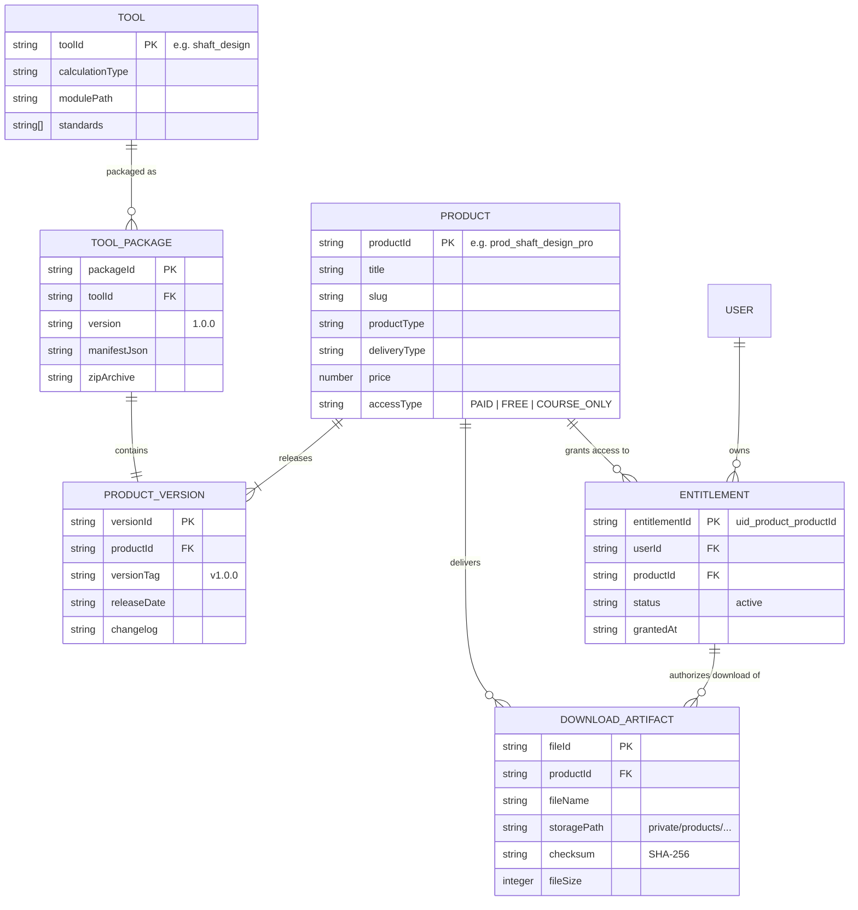

# Product-Tool Data Contract Specification

> **Project**: MechanicalBKA Web  
> **Document**: Product-Tool Domain Contract  
> **Phase**: 14D Architecture  
> **Status**: APPROVED  
> **Date**: 2026-08-31  

---

## 1. Domain Entities & Relationships

The commercialization of engineering tools connects six core domain entities:



---

## 2. Entity Specifications

### 2.1 `Tool` (Engineering Core)
The algorithmic implementation of an engineering calculation or automation process.
- **Location**: `engineering-workspace/modules/<toolId>.py`
- **Contract**: Accepts `EngineeringCalculationRequest`, returns `EngineeringCalculationResult` (SSOT).
- **Execution**: Deterministic Python function verified by pytest unit tests.

### 2.2 `ToolPackage` (Packaged Distribution)
A self-contained directory or archive containing the tool, dependencies, manifest, documentation, and runners.
- **Artifact**: `.zip` file generated by build/packaging scripts.
- **Root Content**: `manifest.json`, `README.md`, `LICENSE.txt`, `app/`, `templates/`, `examples/`, `docs/`.

### 2.3 `Product` (Storefront Entity)
The commercial listing displayed to customers on the MechanicalBKA website.
- **Storage**: Firestore `/products/{productId}` and `src/mock/data.js`.
- **Attributes**: `id`, `title`, `slug`, `price`, `accessType`, `productType`, `deliveryType`, `highlights`, `includedFiles`, `isPublished`.

### 2.4 `ProductVersion` (Release Management)
Tracks the release history of a product.
- **SemVer Format**: `MAJOR.MINOR.PATCH` (e.g. `1.0.0`, `1.1.0`).
- **Compatibility Tracking**: Specifies minimum Python version, supported OS, and compatible software.

### 2.5 `DownloadArtifact` (Secure File Storage)
A physical file stored in private Cloud Storage accessible only via verified signed URLs.
- **Firestore Subcollection**: `/products/{productId}/files/{fileId}`.
- **Storage Location**: `private/products/{productId}/{fileId}/{fileName}`.
- **Security Rule**: Cloud Storage direct read blocked for all users; access strictly through Cloud Functions `/api/download`.

### 2.6 `Entitlement` (Access Grant)
A deterministic record granting a specific user access to download and use a product.
- **ID Format**: `${uid}_product_${productId}` (or `${uid}_course_${courseId}`).
- **Creation**: Generated automatically upon successful payment verification.
- **Validation**: Checked in `accessService.js` (client) and `functions/index.js` (backend).

---

## 3. Data Flow: From Code to Customer Download

```
[Developer]
    │  Writes module: engineering-workspace/modules/shaft_design.py
    │  Runs packager: python scripts/package_tool.py --module shaft_design
    ▼
[ToolPackage (.zip) + manifest.json]
    │  Uploaded via Admin CMS to private Cloud Storage
    │  Firestore product metadata created
    ▼
[Product Published on Storefront]
    │  Customer views /product/shaft-design-tool
    │  Adds to cart & completes checkout (orderService.js)
    ▼
[Entitlement Created in Firestore]
    │  Document: entitlements/${uid}_product_prod_shaft_tool
    ▼
[Customer Requests Download]
    │  Client calls GET /api/download?productId=...&fileId=...
    │  Cloud Function verifies Auth Token & Entitlement
    │  Generates 5-minute time-limited Signed URL
    ▼
[Customer Receives Verified Package]
```
